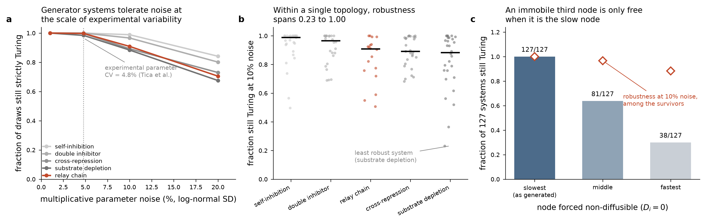

# Measuring robustness — what exists, what is broken, and what the data says

**Status: information, not instruction.** "More robust than Tica et al." is the project's
stated end goal, and robustness is currently the **least instrumented** quantity in the
pipeline. This document records what the reference number is, what our code would
produce today, why the two are not comparable, and what the training data's own
robustness actually is.

---

## 1. The reference quantity

Tica et al. report robustness as a **local parameter-volume fraction**: perturb the
fitted parameter vector by a relative uncertainty and ask what fraction of the
perturbed systems still give a Turing I solution.

| relative uncertainty | fraction still Turing I |
|---|---|
| 1 % | **33 %** |
| 5 % | **5 %** |
| — (global, Latin hypercube over the whole biologically relevant box) | **0.022 %** |

Also reported: 4 % Hopf, 0.004 % Turing–Hopf, and that the **measured experimental
parameter CV between biological repeats was 4.8 %** (averaged over Vm and Km across
three subcircuits). That 4.8 % is the noise level at which a robustness claim is
experimentally meaningful, which is why it is one of the four levels measured below.

Two properties of their number to carry forward:

- It is **local**, anchored at a specific fitted point, not a global hit rate. Their
  feasibility argument is precisely that 0.022 % global and 33 % local coexist.
- It is over the **full kinetic parameter vector of a six-equation non-dimensionalised
  model**, with the steady state, Jacobian and stability re-derived for each draw.

---

## 2. What exists in this repo

`src/rngrn/eval/analysis.py::robustness_cloud(model, n_samples=200, sigma_log=0.1, seed=0)`

> **CORRECTED 2026-08-11 — §2 and §3 below describe code that no longer exists.** They are
> kept because the before/after is the record, but read this box first. Every defect §3
> catalogues was fixed in `8321133` (2026-07-29), and the current
> `eval/analysis.py::robustness_cloud` docstring names §3 by number as its changelog.
> Concretely, today: it perturbs the **physical (J, D)** at the model's own steady state,
> not raw θ (so a lognormal factor cannot flip a sign and a given `sigma_log` means the
> same thing everywhere); there is no per-draw model rebuild, so `dispersion_backend`
> cannot be dropped and the ~59 ms/draw Newton loop is gone, replaced by batched numpy;
> and it reports the **strict** criterion as `frac_turing`, with `frac_loose` /
> `frac_loose_only` alongside. It **is** validated and it **does** reach the run index:
> `validate.py:64,386` calls `robustness_volumes(...)`, writing
> `turing_volume_{1pct,4p8pct,10pct,20pct}` onto **every run row**. It has been run on real
> recoveries — see `C1_COMPETITIVE_TUNING.md` §9.2 (`robustness_n_used = 8`).
> §1 (the Tica reference numbers), §4 (the 127-sample generator baseline) and §5's
> still-open items remain current.
>
> **Extended 2026-08-14 — a separate, later fix to `turing_ok` itself, not covered above.**
> The fix above (`8321133`, 2026-07-29) is to `robustness_cloud`'s perturbation and speed; it
> already reports the strict criterion. §3.5 below is about a different function,
> `eval/analysis.py::turing_ok`, evaluated at a single (J, D) rather than over a cloud. As of
> a **later, separate fix** (2026-08-04, D-EVID-11; `analysis.py:30-35,72`), `turing_ok`'s own
> default test (`stable_uniform`, feeding `ok`) is also the **strict** `max Re eig(J) < 0`,
> not the `tr(J) < 0` §3.5 describes below — that trace test now survives only as the
> separately-reported `turing_loose` / `stable_uniform_loose`. So "`turing_ok` tests
> `tr(J) < 0`" (§3.5) and "`eval/analysis.py::turing_ok` uses the loose test" (as echoed in
> `docs/BIO_VIABILITY.md` §1.3) both describe the pre-2026-08-04 function. §3.5's underlying
> measurement (1215 loose vs. 19 strict acceptances on the same 80,000 draws) is untouched.

*Historical, as of 2026-07-29 — superseded, see the box above:*

It draws `n_samples` log-normal multiplicative perturbations of the model's **raw θ**
parameters, rebuilds an `RNGRN`, re-solves the steady state, re-tests the Turing
conditions, and returns `frac_turing`, `n_turing`, `kstar_mean`, `kstar_std`.

Reachable as `rngrn analyze --run-id <id>`, configured by
`solver.robustness_samples` / `solver.robustness_sigma_log`.

**It has never been run on a recovery result, has never been validated, and its output
does not reach the run index** — `cmd_analyze` prints JSON to stdout and returns. The
module docstring flags itself as repackaged-from-scaffold and unvalidated.

---

## 3. Four defects that make its current output non-comparable

Measured, not inferred. Reproduce with `RNGRN(N=3, seed=0)`.

### 3.1 It perturbs raw θ, so "10 % noise" is not 10 % on anything physical

Every physical parameter is a nonlinear transform of θ (`softplus` for s/α/δ/β,
`sigmoid` for the gate, `exp` for D). A log-normal factor with `sigma_log = 0.1`
applied to θ produces wildly unequal physical perturbations:

| parameter | θ range at seed 0 | median \|Δphysical/physical\| | max |
|---|---|---|---|
| `theta_s` | −2.089 … −0.230 | **5.6 %** | 12.3 % |
| `theta_beta` | −1.394 … −0.844 | 2.6 % | 7.0 % |
| `theta_D` | −1.109 … 0.271 | 1.5 % | 2.4 % |
| `theta_alpha` | −0.755 … 0.728 | 1.5 % | 6.7 % |
| `theta_g` | −0.536 … 0.550 | 0.9 % | 5.4 % |
| `theta_delta` | −0.237 … −0.006 | **0.4 %** | 1.6 % |

A single `sigma_log` therefore delivers a ~14× spread in effective physical noise
across parameter families, and the mapping depends on **where θ happens to sit** — so
two recoveries perturbed at the same `sigma_log` are not perturbed comparably. Tica's
uncertainty is on physical/non-dimensional parameters.

### 3.2 The multiplicative factor is applied to a value that can be negative

θ is unconstrained and typically negative (see the ranges above). Multiplying a negative
θ by a log-normal factor > 1 makes it *more* negative, which moves the physical value
*down* — so a "positive" perturbation and a "negative" one are not symmetric about the
base point, and the direction depends on θ's sign. A physically meaningful cloud would
perturb the constrained values (or add noise in log-physical space).

### 3.3 It silently drops `dispersion_backend`

The rebuild is `RNGRN(N=model.N, form=model.form, n_hill=model.n_hill)` — no
`dispersion_backend`. A model recovered with `dispersion_backend='cubic'` is therefore
evaluated with `'eig'` inside the cloud. Numerically the two agree to 9.2e-13, so this
is not a correctness bug; it silently forfeits the 162× CUDA speedup exactly where the
work is embarrassingly parallel.

### 3.4 It is serial and slow

Measured: **~59 ms per draw** (`n_samples=50` in 3.0 s), so the default `n_samples=200`
is ~12 s per model, per noise level. A seed distribution over 16 seeds × 4 noise levels
× 19 val samples is ~4 hours of pure cloud evaluation. Each draw constructs a fresh
`nn.Module` and runs an independent damped-Newton steady-state solve in a Python loop.

This is the same shape of problem the cubic dispersion solved — see
`STATE_OF_THE_SCIENCE.md` §4.2: the crossover for GPU is ~6,400 matrices and a cloud of
200 draws × 250 k-points is 50,000.

### 3.5 A fifth issue, in the criterion rather than the cloud

`turing_ok` tests `tr(J) < 0` for uniform stability. That is **necessary but not
sufficient** — a 3×3 with negative trace can still have an eigenvalue with positive real
part. On the unperturbed data this happens not to matter (§4.1), but under perturbation
the loose criterion overcounts: median 0.5 % of draws at 10 % noise, 9.8 % at 20 %, and
**up to 70 % of draws for a single sample**. Since the whole point of a robustness number
is to count draws under perturbation, the criterion has to be the strict one.

`turing_ok` also never inspects whether the leading mode at k\* is **complex**, which is
what separates Turing I from Turing–Hopf — the exact distinction Tica quantify (4 % Hopf,
0.004 % Turing–Hopf).

---

## 4. Measured baseline: the robustness of the generator systems

Produced by `scripts/exp11_robustness_baseline.py` (deterministic; seeds via
`blake2b`, not `hash()`, which Python salts per process). Rows in
`experiments/exp11_robustness_baseline.csv` and `experiments/exp11_immobile_node.csv`.

**Method.** For each of the 127 `three_gene` answer keys: draw 400 independent
log-normal multiplicative factors on every **nonzero** Jacobian entry and on every
diffusivity. Sign- and topology-preserving by construction — magnitudes move, signs and
structural zeros do not. Criterion: **strict** — `max Re eig(J) < 0` **and** an unstable
mode at some k > 0, on a 251-point k-grid over [0, 4].

This is a different perturbation model from Tica's and from `robustness_cloud`'s. It
perturbs `(J, D)` of an already-Turing system directly, rather than perturbing kinetic
parameters and re-deriving `x*` and `J`. That makes it a **clean upper reference** —
it isolates how much slack the linear-stability geometry has, with no steady-state
re-solve to fail — but it is **not** the same measurement as either. Stated plainly so
the numbers below are not misread as a like-for-like comparison.

### 4.1 The unperturbed systems

All 127 are strictly Turing. **127/127** also pass the loose `tr(J) < 0` criterion, none
have `tr(J) < 0` with a positive-real-part eigenvalue of J, none have a complex leading
mode at k\*, and none are unstable at k = 0. So on the *unperturbed* data the repo's
loose criterion is harmless — the divergence appears only under perturbation.

Recomputed k\* and σ_max agree with the stored attrs to a median 0.032 % and 0.0008 %
respectively, so the stored answer-key values are trustworthy.

### 4.2 Local Turing volume vs noise level

| noise SD | mean | **median** | worst sample |
|---|---|---|---|
| 1 % | 0.993 | **1.000** | 0.538 |
| **4.8 %** (Tica's measured CV) | 0.954 | **1.000** | 0.385 |
| 10 % | 0.879 | **0.935** | 0.232 |
| 20 % | 0.746 | **0.755** | 0.220 |

k\* itself is stable inside the surviving cloud: median CV 0.8 % at 1 % noise, 2.9 % at
4.8 %, 5.5 % at 10 %, 10.6 % at 20 %. So perturbation degrades *whether* the system
patterns faster than it degrades *what wavelength* it picks — which matters, because the
project's success criterion is the dominant spatial mode.

### 4.3 Robustness is not a property of topology

At 10 % noise, per topology:

| topology | min | median | max | max/min |
|---|---|---|---|---|
| `selfinhib` | 0.498 | 0.989 | 1.000 | 2.01 |
| `double_inhibitor` | 0.690 | 0.966 | 1.000 | 1.45 |
| `relay_chain` | 0.507 | 0.909 | 1.000 | 1.97 |
| `cross_repress` | 0.682 | 0.892 | 1.000 | 1.47 |
| `substrate_depl` | 0.232 | 0.884 | 1.000 | **4.30** |

Every topology contains both a fully robust system (1.000) and a fragile one. Since each
topology in this dataset has exactly **one** interaction matrix (verified — no
within-topology wiring variation), the entire spread is **parameter-driven**.

That is the headroom the "engine" framing needs: for the same wiring, some
parameterisations are 4× more robust than others. An optimiser that targeted robustness
would have something real to find.

Weak monotone associations at 10 % noise: Spearman ρ = **+0.26** with D-ratio (larger
ratio, slightly more robust — consistent with the literature claim that differential
diffusivity buys robustness) and **−0.26** with k\* (longer-wavelength systems slightly
more robust). Neither is strong enough to be a design rule.

By morphology (median at 10 %): spots 0.955, labyrinth 0.931, **stripes 0.870**. Stripes
is both the least robust class *and* the class the morphology scorer is weakest on
(33.3 % held-out) *and* the class Tica's target pattern belongs to.

### 4.4 Tica's immobile third node, tested directly

Their node C does not diffuse, stated purposes being to enlarge the patterning parameter
set and to *relax the differential-diffusion requirement*. Setting one diffusivity to
exactly zero in each of the 127 systems:

| node made non-diffusible | still strictly Turing | median robustness at 10 % among survivors |
|---|---|---|
| the **slowest** diffuser | **127 / 127** | **1.000** |
| the middle diffuser | 81 / 127 | 0.968 |
| the **fastest** diffuser | 38 / 127 | 0.884 |
| *(unchanged, for reference)* | 127 / 127 | 0.960 |

In all 127 samples the slowest diffuser is species index 0 — the generators fix
`D[0] = 1` and draw the other two 10–250× faster — and index 0 is also the
self-activating node (the single positive diagonal entry).

**Two readings, both worth holding:**

1. Immobilising the slow self-activator is not merely harmless, it *improves* local
   robustness (1.000 vs 0.960). That is a measured corroboration of Tica's rationale
   for node C. It also makes sense: with `D₀ = 0` the activator cannot smooth its own
   peak, so the long-wavelength instability is easier to hold.
2. But immobilising a **fast** node destroys patterning in 70 % of systems (worst:
   `relay_chain`, 1/18 survives). So "add a non-diffusible third node" is not a
   generic topology trick — it works *because the immobile node is on the slow,
   activator side*. Anything built to mimic C should place it there.



*Panel (a): median local Turing volume vs perturbation size, per topology; the dotted
line is Tica's measured 4.8 % experimental CV. (b): per-system spread at 10 % noise —
each point is one of the 127 samples, bar is the median. (c): effect of forcing one
node non-diffusible (bars, left axis) with the surviving systems' median robustness
overlaid (diamonds). n = 127 systems, 400 cloud draws each; "Turing" is the strict
criterion of §4.*

---

## 5. What a claim comparable to Tica's would require

Not a plan — the list of things that currently prevent the comparison.

1. **A matched perturbation model.** Tica perturb kinetic parameters and re-derive
   everything. The RNGRN equivalent is perturbing the **physical** parameters
   (`s, gate, α, δ, β, D`) or θ *in log-physical space*, then re-solving `f(x*) = 0` —
   which is what `robustness_cloud` attempts but does in raw-θ space (§3.1, §3.2).
   §4's `(J, D)` perturbation is a different, looser quantity.
2. **The strict criterion, plus a Turing-I/Hopf/Turing–Hopf classification.** Otherwise
   the count includes draws whose uniform state is Hopf-unstable (§3.5) and cannot
   report the classes Tica report.
3. **Steady-state failures counted, not swallowed.** `robustness_cloud` catches every
   exception and records the draw as non-Turing. That conflates "this parameter set does
   not pattern" with "the Newton solve did not converge". Tica's denominator is sampled
   parameter combinations; ours would silently mix in solver failures.
4. **A stated anchor point.** A local volume is meaningless without saying which
   recovered parameter point it surrounds, and — given the seed distribution framing —
   whether the reported number is per-seed or pooled across seeds.
5. **A recovery that works on the target.** Currently 2 of 6 val samples
   (`STATE_OF_THE_SCIENCE.md` §2.4). There is no robustness claim to make about a
   system that was not recovered.
6. **A decision on the robustness axis itself.** `GOAL_tica_equivalent.md` §2 lists four
   incompatible readings of "more robust" (parameter volume / relaxed differential
   diffusion / structured experimental perturbations). Tica's own pattern was destroyed
   by DAPG, 30 °C, permeable boundaries and thick agar — *coordinated* shifts, not
   isotropic noise. Isotropic log-normal noise is a proxy whose adequacy has not been
   argued.

---

## 6. Reproducing the numbers here

```bash
cd <worktree>
.venv/bin/python scripts/exp11_robustness_baseline.py --ndraw 400
# ~60 s, writes experiments/exp11_{robustness_baseline,immobile_node}.csv
```

Deterministic across processes (verified identical under `PYTHONHASHSEED=99`).

**Corrected 2026-08-11.** This paragraph used to say the `experiments/` tree is gitignored,
so the CSVs are "working data, not a tracked record — the script is the record." That was
reversed by D-PLOT-1: run records are now **tracked**, and both
`experiments/exp11_robustness_baseline.csv` and `experiments/exp11_immobile_node.csv` are in
git (verified). The script and its output are *both* the record.

The script reads `AnswerKey` quantities directly and deliberately: it is a
characterisation tool on the scoring side of the firewall. It must never be imported by
`model.py`, `losses/`, or `recover.py`. Note also the trap in
`STATE_OF_THE_SCIENCE.md` §1: tuning anything on these measured true-D values and then
reporting against the same samples routes the answer key into recovery through
judgement, which the static import test cannot see.
